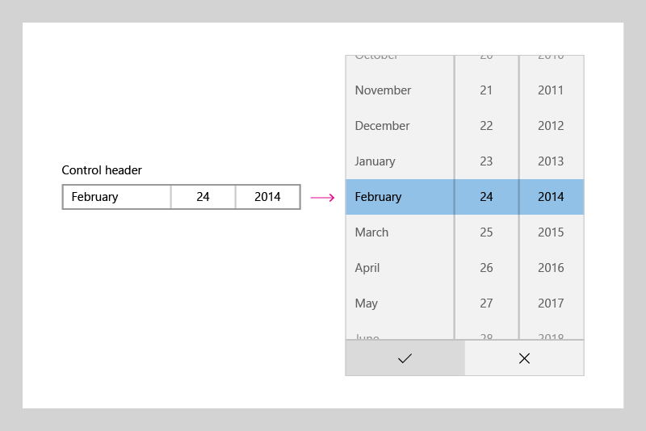

# Date picker

 

The date picker gives you a standardized way to let users pick a localized date value using touch, mouse, or keyboard input. 

> **Important APIs**: [DatePicker class](https://msdn.microsoft.com/library/windows/apps/xaml/windows.ui.xaml.controls.datepicker.aspx), [Date property](https://msdn.microsoft.com/library/windows/apps/xaml/windows.ui.xaml.controls.datepicker.date.aspx)


## Is this the right control?
Use a date picker to let a user pick a known date, such as a date of birth, where the context of the calendar is not important.

For more info about choosing the right date control, see the [Date and time controls](date-and-time.md) article.

## Examples

<div style="overflow: hidden; margin: 0 -8px;">
    <div style="float: left; margin: 0 8px 16px; min-width: calc(25% - 16px); max-width: calc(100% - 16px); width: calc((580px - 100%) * 580);">
        <div style="height: 133px; width: 100%">
            </img>
        </div>
    </div>
    <div style="float: left; margin: -22px 8px 16px; min-width: calc(75% - 16px); max-width: calc(100% - 16px); width: calc((580px - 100%) * 580);">
        <p>If you have the <strong style="font-weight: semi-bold">XAML Controls Gallery</strong> app installed, click here to <a href="xamlcontrolsgallery:/item/DatePicker">open the app and see the DatePicker in action</a>.</p>
        <ul>
        <li><a href="https://www.microsoft.com/store/productId/9MSVH128X2ZT">Get the XAML Controls Gallery app (Microsoft Store)</a></li>
        <li><a href="https://github.com/Microsoft/Windows-universal-samples/tree/master/Samples/XamlUIBasics">Get the source code (GitHub)</a></li>
        </ul>
    </div>
</div>

The entry point displays the chosen date, and when the user selects the entry point, a picker surface expands vertically from the middle for the user to make a selection. The date picker overlays other UI; it doesn't push other UI out of the way.



## Create a date picker

This example shows how to create a simple date picker with a header.

```xaml
<DatePicker x:Name=birthDatePicker Header="Date of birth"/>
```

```csharp
DatePicker birthDatePicker = new DatePicker();
birthDatePicker.Header = "Date of birth";
```

The resulting date picker looks like this:


> **Note**&nbsp;&nbsp;For important info about date values, see [DateTime and Calendar values](date-and-time.md#datetime-and-calendar-values) in the Date and time controls article.

## Get the sample code

- [XAML Controls Gallery sample](https://github.com/Microsoft/Windows-universal-samples/tree/master/Samples/XamlUIBasics) - See all the XAML controls in an interactive format.

## Related articles

- [Date and time controls](date-and-time.md)
- [Calendar date picker](calendar-date-picker.md)
- [Calendar view](calendar-view.md)
- [Time picker](time-picker.md)
