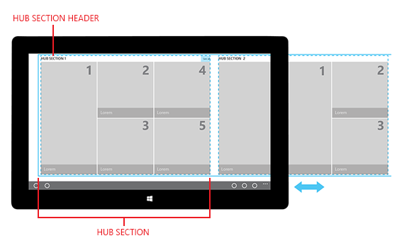
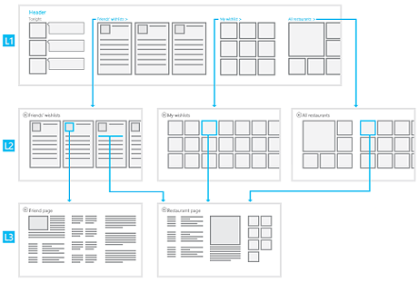
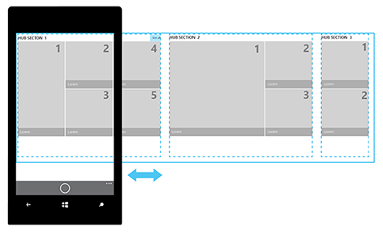
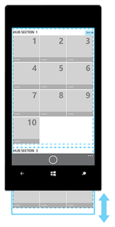
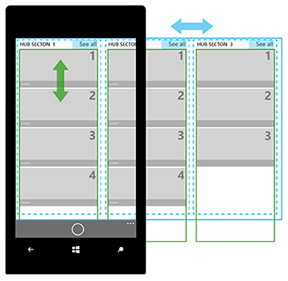
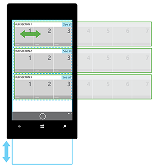
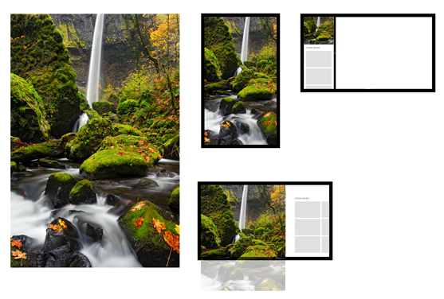
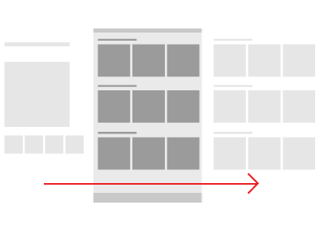

# Hub control/pattern

 

A hub control lets you organize app content into distinct, yet related, sections or categories. Sections in a hub are meant to be traversed in a preferred order, and can serve as the starting point for more detailed experiences.

> **Important APIs**: [Hub class](https://msdn.microsoft.com/library/windows/apps/dn251843), [HubSection class](https://msdn.microsoft.com/library/windows/apps/dn251845)

Content in a hub can be displayed in a panoramic view that allows users to get a glimpse of what's new, what's available, and what's relevant. Hubs typically have a page header, and content sections each get a section header.

## Is this the right control?

The hub control works well for displaying large amounts of content that is arranged in a hierarchy. Hubs prioritize the browsing and discovery of new content, making them useful for displaying items in a store or a media collection.

The hub control has several features that make it work well for building a content navigation pattern.

-   **Visual navigation**

    A hub allows content to be displayed in a diverse, brief, easy-to-scan array.

-   **Categorization**

    Each hub section allows for its content to be arranged in a logical order.

-   **Mixed content types**

    With mixed content types, variable asset sizes and ratios are common. A hub allows each content type to be uniquely and neatly laid out in each hub section.

-   **Variable page and content widths**

    Being a panoramic model, the hub allows for variability in its section widths. This is great for content of different depths or quantities.

-   **Flexible architecture**

    If you'd prefer to keep your app architecture shallow, you can fit all channel content into a hub section summary.

A hub is just one of several navigation elements you can use; to learn more about navigation patterns and the other navigation elements, see the [Navigation design basics for Universal Windows Platform (UWP) apps](../basics/navigation-basics.md).

## Hub architecture

The hub control has a hierarchical navigation pattern that support apps with a relational information architecture. A hub consists of different categories of content, each of which maps to the app's section pages. Section pages can be displayed in any form that best represents the scenario and content that the section contains.

## Layouts and panning/scrolling

There are a number of ways to lay out and navigate content in a hub; just be sure that content lists in a hub always pan in a direction perpendicular to the direction in which the hub scrolls.

**Horizontal panning**

**Vertical panning**

**Horizontal panning with vertically scrolling list/grid**

**Vertical panning with horizontally scrolling list/grid**

## Examples

    

        

            </img>
        

    

    

        
If you have the <strong style="font-weight: semi-bold">XAML Controls Gallery</strong> app installed, click here to <a href="xamlcontrolsgallery:/item/Hub">open the app and see the Hub in action</a>.

        <ul>
        <li><a href="https://www.microsoft.com/store/productId/9MSVH128X2ZT">Get the XAML Controls Gallery app (Microsoft Store)</a></li>
        <li><a href="https://github.com/Microsoft/Windows-universal-samples/tree/master/Samples/XamlUIBasics">Get the source code (GitHub)</a></li>
        </ul>
    

The hub provides a great deal of design flexibility. This lets you design apps that have a wide variety of compelling and visually rich experiences. You can use a hero image or content section for the first group; a large image for the hero can be cropped both vertically and horizontally without losing the center of interest. Here is an example of a single hero image and how that image may be cropped for landscape, portrait, and narrow width.

On mobile devices, one hub section is visible at a time.

## Recommendations

-   To let users know that there's more content in a hub section, we recommend clipping the content so that a certain amount of it peeks.
-   Based on the needs of your app, you can add several hub sections to the hub control, with each one offering its own functional purpose. For example, one section could contain a series of links and controls, while another could be a repository for thumbnails. A user can pan between these sections using the gesture support built into the hub control.
-   Having content dynamically reflow is the best way to accommodate different window sizes.
-   If you have many hub sections, consider adding semantic zoom. This also makes it easier to find sections when the app is resized to a narrow width.
-   We recommend not having an item in a hub section lead to another hub; instead, you can use interactive headers to navigate to another hub section or page.
-   The hub is a starting point and is meant to be customized to fit the needs of your app. You can change the following aspects of a hub:
    -   Number of sections
    -   Type of content in each section
    -   Placement and order of sections
    -   Size of sections
    -   Spacing between sections
    -   Spacing between a section and the top or bottom of the hub
    -   Text style and size in headers and content
    -   Color of the background, sections, section headers, and section content

## Get the sample code

- [XAML Controls Gallery sample](https://github.com/Microsoft/Windows-universal-samples/tree/master/Samples/XamlUIBasics) - See all the XAML controls in an interactive format.

## Related articles

- [Hub class](https://msdn.microsoft.com/library/windows/apps/dn251843)
- [Navigation basics](../basics/navigation-basics.md)
- [Using a hub](https://msdn.microsoft.com/library/windows/apps/xaml/dn308518)
- [XAML Hub control sample](http://go.microsoft.com/fwlink/p/?LinkID=310072)
