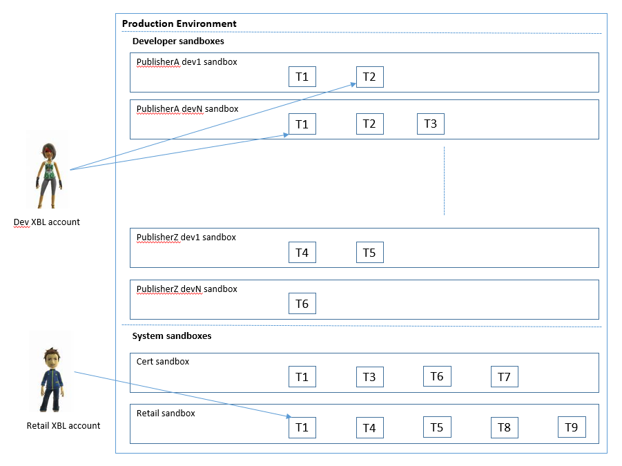
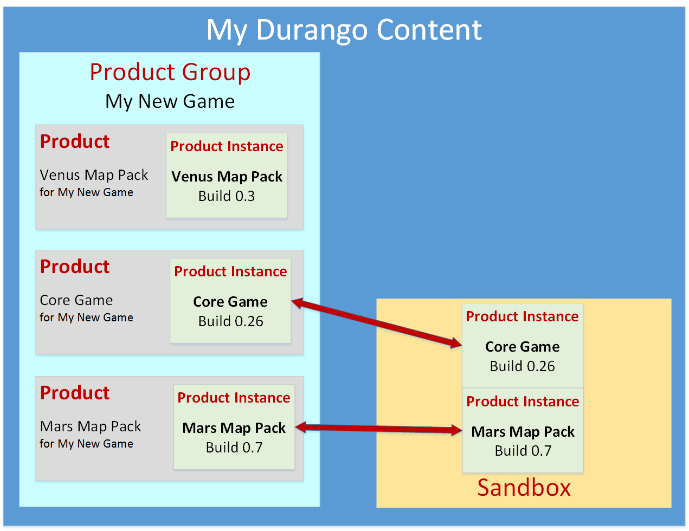
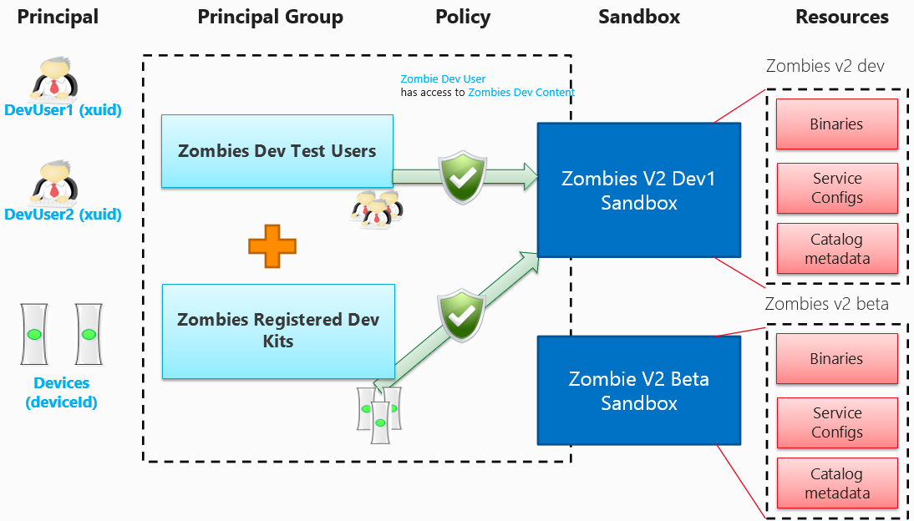
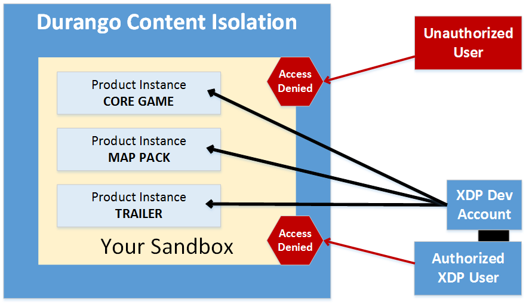
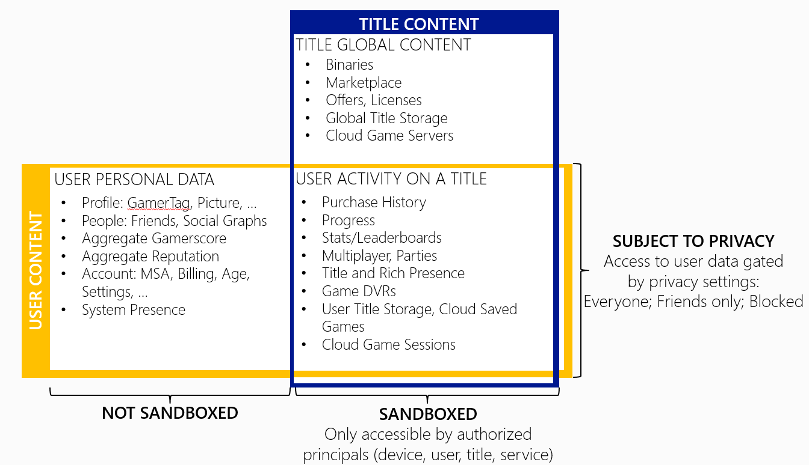
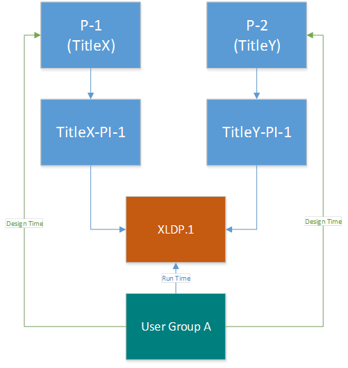
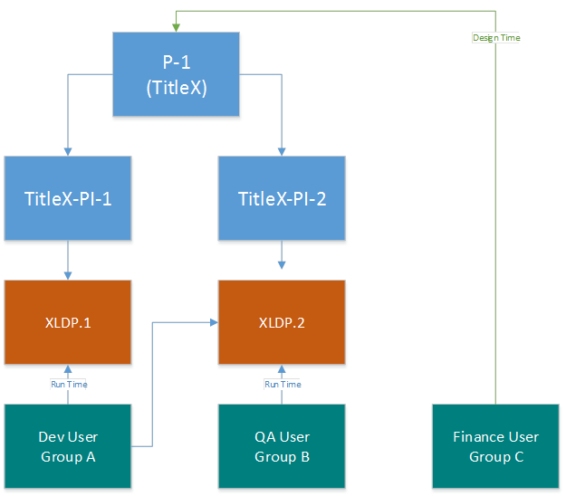
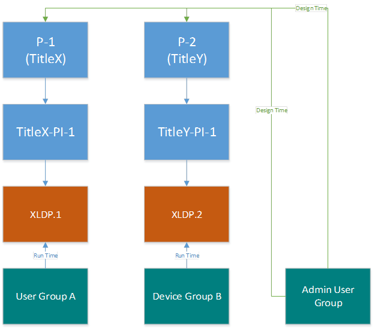
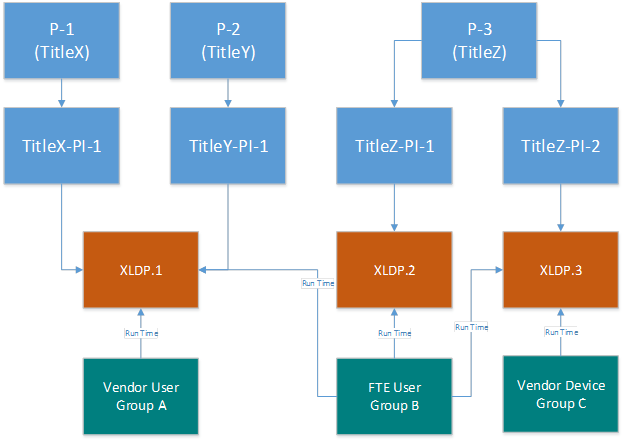

# Advanced Xbox Live sandboxes

> **Note** This article explain advanced usage of sandboxes and is mainly applicable to large gaming studios which have multiple teams and complex permissions requirements.  If you are part of the Xbox Live Creators Program or an ID@Xbox developer, it is recommended to look at the [Xbox Live Sandboxes Intro](../xbox-live-sandboxes.md)

The Xbox Live *sandbox* provides an entire private environment for development. This document explains what sandboxes are, why they exist, how they apply to publishers, and how they impact internal Xbox teams. The audience for this document is publishers who build Xbox One content and use sandboxes.

## Summary

In Xbox Live, there is only a single production environment where all prerelease (in-development and beta), certification, and retail content resides.

Content isolation is the way to ensure that there are no publisher content leaks in production. At its core, content isolation ensures that any principal user, device, or title that requests permission to access a resource (a title or a service) has been authorized to access the resource. With content isolation, partitions are divided into sandboxes where title or service data is stored. Said differently, authorization policies are defined within the scope of a sandbox.

Sandboxes are a way to partition data that is in production. With Xbox 360 era services, PartnerNet and ProductionNet are two distinct environments. With Xbox One era services, a single production environment contains *n* distinct virtual environments where each virtual environment is called a sandbox. Because there is a single production environment for all content, sandboxes are actually unique virtual environments where data generated in one environment cannot cross over to another.

The following figure shows a single production environment in which publishers can create their private development sandboxes. Only authorized dev accounts or dev kits are permitted access to these sandboxes.

Figure 1. Sandboxes in a production environment.

Just as PublisherA has her development sandboxes, other publishers have their own development sandboxes. The same title ID may reside in different sandboxes but the data generated for the title ID is distinct across sandboxes.

There are two system sandboxes that can only be populated by Microsoft: CERT and RETAIL. As the names suggest, the CERT sandbox is for titles that are undergoing certification prior to release, while the RETAIL sandbox is the sandbox representing real dollars that is accessible by all retail users and devices.

Whereas a title ID was formerly unique in Xbox Live, now a title ID plus a sandbox ID is unique. The same applies to product IDs and other ID spaces that were once treated as unique. They must now be paired with a sandbox ID. All data in Xbox Live will be primarily partitioned by the sandbox ID throughout the system.

## Initial setup for a title

A title is born in the Xbox Developer Portal (XDP) or Windows Dev Center. It is assigned a title ID and a product ID and a service configuration ID (SCID).

In this new world, a title or product on its own doesn’t mean anything to Xbox Live. Because we must support simultaneous retail and development use of a single title, we must support *instancing* of titles in order to make and maintain the necessary distinctions. An instance of a title resides in a sandbox and this is where sandboxes come in.

In order to create a title, a publisher creates a product group, specifies the genre for the product group, and then creates individual products within it. (For more details, refer to the XDP documentation.) The following diagram illustrates the relationships between a product group, a product, a product instance, and a sandbox.

Figure 2. The relationships between a product group, a product, a product instance, and a sandbox.

Product instances
-----------------

A *product instance* is a projection of title, product, and configuration data in a specific sandbox. This data is described in the following three areas: service configuration, catalog metadata, and binaries.

### Service configuration

> Service configuration definitions (events, stats, achievements, etc.). The service configuration is defined at the product instance level.

### Catalog metadata

> The metadata which lives in the Catalog, including sell text, art assets, availability/offer information, licensing data, and more.

### Binary

> A binary can be represented in either of two ways:

1.  Metadata only to enable sideloading. This includes content ID, version info, and licensing info.

2.  Full binary propagated to a CDN and downloadable to a client.

Getting the access right
------------------------

There are two distinct types of access to your content in Xbox One:

*Design-time access*—access from a PC via the XDP tool—allows people working on your products to upload, organize, and work with content, configuration, and metadata, but does not allow them to run or play instances of your products.

*Run-time access*—access from an Xbox console—allows your developers, testers, reviewers, and eventually your customers to run and play product instances.

**Note** In order to be available for run-time access, a product instance must be placed in a sandbox. Once a build is placed in a sandbox, XDP users or devkit devices that have been granted access to that sandbox can run the instance. To do this, they log on to Xbox One via an Xbox console, using one of their dev accounts—special accounts that function as virtual users for run-time access.

When we are talking about sandboxes, we are typically talking about run-time access to content that runs on Xbox Live. In order to access a service in Xbox Live, a title ID is required. Once an **appxmanifest** contains a title ID, the console will send the title ID to Xbox Live. Xbox Live security services will not provide back a valid token unless the principal (device or user) has been given access to the title.

This validation process is the crux of content isolation. When seen at a very high level:

-   A principal group can contain Xbox User IDs (XUIDs), device IDs, title IDs or service IDs.

-   A sandbox can contain title IDs, product IDs or service config IDs (SCIDs).

-   A principal group is given access to a sandbox.

So, for a user or device to access a pre-release title in a sandbox, access must be granted through XDP first.

Figure 3. A model for setting up access through XDP.

The effectiveness of content isolation is based on the fact that your organization owns the following processes:

-   Creating your XDP user accounts, the dev accounts that each user will use to log on for run-time access, and the user groups in which each user is granted membership.

-   Creating device groups of trusted consoles.

-   Specifying for each of your development sandboxes precisely which user groups and device groups have access to the product instances in it.

An example of this setup is illustrated in the figure below.

Figure 4. An unauthorized user's credentials fail to gain access to the sandbox, as do the ordinary credentials of an authorized XDP user account. Only the credentials of the dev account owned by the authorized XDP user account succeed in gaining run-time access to the sandbox, and to all of the product instances currently in it.

### Dev accounts setup

Dev accounts in Xbox One are just standard Microsoft accounts (MSA) with special rules applied to them. They are used in Xbox Live for development. A dev account:

-   Must be created from XDP or Windows Dev Center.

-   Is assigned the external developer role when created by publishers.

-   Is tied to the XDP account or Windows Dev Center account that created the dev account.

-   Can only log in to dev kits. Login is denied to a dev account on retail devices.

-   Can purchase Xbox Live Developer Gold subscription or other subscriptions for free in order to test.

### User group setup

A user group, the first kind of principal group, is a collection of XDP users. When XDP users are added to user groups, their dev accounts flow with these XDP users.

So when a user group is assigned to a sandbox, the dev accounts associated with the XDP users in that user group get added to appropriate principal groups and the principal groups get a policy setup with the primary resource set backing the sandbox.

**Note** The user groups that are created to access sandboxes are the same user groups that are used to prevent access to configuration data in XDP for product groups and products.

### Device setup

A device also gets added to a principal group. A device can only be used as a dev kit if an entitlement is purchased through the Game Developer Store and the device is provisioned to be a dev kit. Once a device is provisioned as a dev kit, the device shows up in the list of devices that can be added to device groups.

### Device group setup

A device group, the second kind of principal group, can also be given access to sandboxes. The setup is similar to the user group setup detailed above.

## Sandboxes

What is a sandbox?
------------------

Stated simply, *a sandbox is a way to partition data in production*.

Why do we need sandboxes?
-------------------------

Just as users and devices access titles, titles access services. We introduce a concept of “title group” where sets of titles are granted access to service resources.

Because there is a single production environment for Xbox One for all content (pre-release and retail), multiple instances (pre-release/retail) of a title must be prevented from operating on the same instances of resources.

What is in a sandbox?
---------------------

A sandbox contains a product instance for every title that gets added to the sandbox.

What is a sandbox ID?
---------------------

A sandbox ID is a partitioning unit of data for a title, product, or service config. Multiple titles can exist in the same sandbox, which is a prerequisite for them to share any service config data.

A sandbox ID (case sensitive) is a string in the following format: &lt;PublisherMoniker&gt;.*n*. An example sandbox ID, XLDP.5, is explained below:

-   The *publisher moniker* is unique across all publishers. So, “XLPD” is the publisher moniker for this particular publisher. A publisher moniker is created when a publisher is “activated” in XDP by the developer account manager.

-   The digit *“n”* identifies the number of the sandbox. In this case, “5” is the sixth sandbox created for this publisher.

When the title data moves through services, Xbox services use the sandbox ID to uniquely identify the “environment” for the data that is generated.

What data is sandboxed?
-----------------------

The diagram below shows what user and title data is sandboxed.

Global override sandbox
-----------------------

A developer sets the sandbox ID on her dev kit and thus sets the sandbox that the dev kit runs in; this is also known as the global override sandbox. Thus, all requests made to Xbox Live services (for example, achievements, matchmaking, licensing, EDS, etc.) from the titles (shell apps and regular apps) in the dev kit are made in that sandbox.

The global override sandbox also implies that only the content ingested in the global override sandbox is visible when being browsed.

Types of sandboxes
-------------------------------------------------------------------------------------------------------------------------------------------------------

There are two different categories of sandboxes. These categories are defined as follows:

-   *Publisher sandboxes*. Publishers have access to their in-development sandboxes. These may look like XLDP.0, XLDP.1, XLDP.2, XLDP.3, etc. This is where publishers would put their title product instances. Access to these sandboxes is gated to the users/devices that the publishers grants access to

-   *Microsoft sandboxes*. These are the built-in sandboxes: RETAIL and CERT Only Microsoft is allowed to publish to these protected sandboxes.

CERT sandbox
------------

When a title is ready for general availability, it needs to go through certification first. The CERT sandbox is a Microsoft-controlled sandbox that only individuals in certification have access to. Publishers can see what content they own is going through certification.

Any product instances that fail while in certification can be brought back to a development sandbox to be debugged and fixed by the publishers using XDP.

RETAIL sandbox
--------------

The RETAIL sandbox is the final destination for all content that is created for Xbox One.

After a title passes certification, it is added to the RETAIL sandbox. Only green signed content is permitted to run in the RETAIL sandbox. This has an important implication that publisher-driven betas are also done in the RETAIL sandbox. Data generated in the RETAIL sandbox represents real customer production data.

Note that access to content is the RETAIL sandbox is still controllable through content isolation.

For example, publisher-driven betas are run in the RETAIL sandbox, where the publisher chooses which principal groups get to access publisher-defined beta resource set titles. The service data generated by the beta titles is real prod data and continues to exist once the title goes to general availability.

Cross-sandbox data interaction
------------------------------

By definition, a sandbox is a container that restricts data sharing. Thus, cross-sandbox data interaction is not possible.

## Organizing your sandboxes

This section provides an example of how a publisher can organize sandboxes. A publisher needs to understand how to use sandboxes to organize data.

**Note** The examples below only show run-time access management with content isolation.

### Scenario 1: Two titles, one sandbox

The basic structure for a publisher could be:

-   Two titles that are accessible to all users and devices owned by the publisher for both design time and runtime.

-   One product instance per title.

In this instance, the publisher just needs a single sandbox for all pre-release content.

The diagram below shows a user group. The publisher may choose to use a device group instead of a user group, if deemed easier. Also, this user group has run-time and design-time access to sandbox XLDP.1 and the titles in this sandbox.

### Scenario 2: One title, different teams

In this model, the requirements are:

-   One title.

-   Dev team works on daily builds.

-   QA team works on weekly LKGs.

-   Dev team needs to debug weekly LKGs in case of bugs.

-   The finance team needs access to the price cards and other metadata related to the catalog release of a title.

The figure below shows that TitleX has two product instances: PI-1 and PI-2. A product instance has to be in a sandbox and two product instances of the same title cannot be in the same sandbox. Thus, TitleX-PI-1 is in sandbox XLDP.1 and TitleX-PI-2 is in sandbox XLDP.2.

The dev user group has access to both sandboxes, whereas the QA user group has access to only sandbox XLDP.2.

Also, the finance user (Group C) has design-time access to TitleX. Because the finance user group will not typically do any run-time debugging of a title, they are separated out.

**Note** Irrespective of the organization, an XDP user can belong in more than one user group.

### Scenario 3: Two titles, completely separate

In this example, the requirements change a bit:

-   Two titles.

-   Access to each title should be limited to a certain set of individuals.

-   One product instance per title.

-   An admin user group who needs access to design-time XDP config data for the titles. The individuals in this group are all admins for the publisher and can control all data that is published to the catalog (catalog metadata, finance, marketing, certification submission, etc.)

In this model, the publisher has chosen to keep both titles completely separated and thus assigned these two titles in two different sandboxes. The publisher has also chosen to create a separate admin user group and assigned access to the two products.

### Scenario 4: Anyway you like it

Due to the number of connections and to keep the verbiage short, we have chosen to show only the sandbox run-time connections. Nothing prevents you from adding other design-time access permissions as well.

In this example, the requirements are:

-   Only certain people have access to certain titles inside their publisher.

-   The publisher works with vendors from different companies and these vendors may be short-term.

-   The publisher should be able to decommission a title and by doing so, prevent access to any data that the vendors or FTEs had access to.

In order to model this requirement, a structure such as the one below can be adopted.

The model followed below is:

-   TitleX and TitleY have only one product instance each in sandbox XLDP.1.

-   TitleZ has two product instances, one in sandbox XLDP.2 and another in sandbox XLDP.3.

-   FTE User Group B is given access to product instances in all sandboxes.

-   Vendor User Group A is a vendor-only user group that is given access to sandbox XLDP.1.

-   Vendor Device Group C is a vendor-only user group that is given access to sandbox XLDP.3.

## Summary

Xbox Live development provides tremendous opportunity to publishers to test in production with production-quality services and production MSA developer accounts. The increase in functionality and flexibility requires new configuration steps in XDP to create title data and manage access to the titles while in development and in general availability.

Sandboxes are a way to partition data in production. Because there is a single production environment for all content, sandboxes act as “virtual environments” where data generated in one environment does not cross over to the other.
