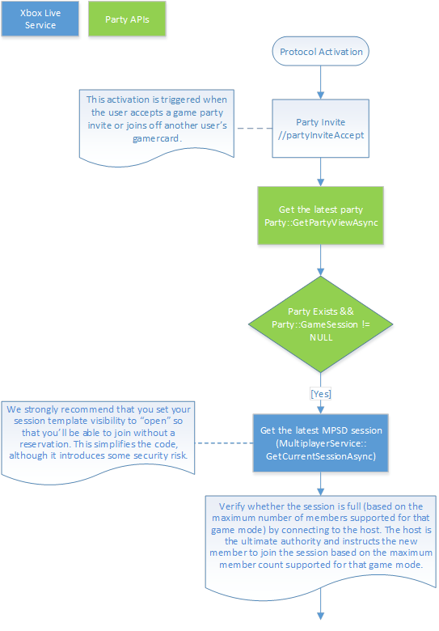
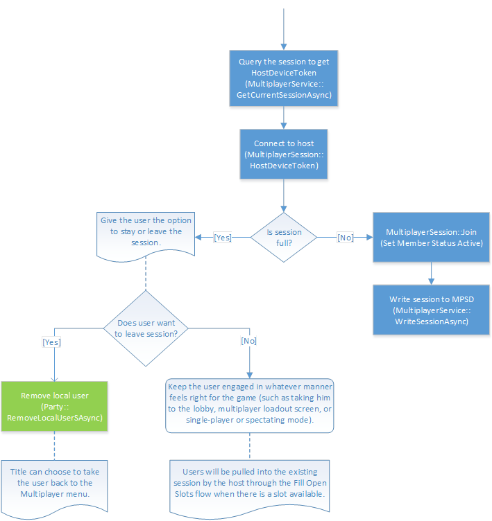

# Game session and game party visibility and joinability

On Xbox One, the *visibility* and *joinability* settings for game sessions and game parties, respectively, control access to multiplayer experiences. To provide a great user experience for session joining, and for inviting players into game sessions and parties, title developers need to understand these settings. This white paper reviews the differences between visibility and joinability, and it discusses the specific settings we recommend that titles use to give their consumers the best multiplayer user flow.

## Game session visibility

Multiplayer Session Directory (MPSD) session access is gated by two settings: session *visibility* and session *joinability*. These settings can be used to limit session access at the MPSD level.

The first aspect of access control is session visibility. Session visibility is a constant that is set at the time of session creation. It is typically defined in the session template and determines which types of users have read and write access to a session. The values for the visibility setting are:

-   *Open—*All users can read and write to the session.

-   *Visible—*All users can read, but only joined and reserved players can write to, the session.

-   *Private—*Only joined and reserved players can read or write to the session.

> **Note:** Setting visibility to private can require retries on the **join()** call by the invited player. If an invite is sent through the platform UI, it can be received by another player before that player has been reserved in the session. This race condition can cause a **join()** call for an invited player to fail because private or visible sessions require a reservation for the joining player.
>
> If no reservation exists, an access error on the session (HTTP/403) is raised. The invited player would then have to retry the **join()** operation, but retries should not be attempted more frequently than every five seconds. We recommend that titles set session visibility to open to avoid race conditions during the join flow for a player.

## Game session joinability

The second aspect to access control is joinability. It can be set dynamically during the session lifetime and determines which types of users can join a session. The values for session joinability are:

-   *None* (default value)—There are no restrictions on who can join the session.

-   *Local*—Only local users can join the session.

-   *Followed—*Only local users and users who are followed by other session members can join the session without a reservation.

A session host or arbiter can create a private session through the joinability setting: making joinability either local or followed will restrict access to a game session and make it private.

Additionally, the session host or arbiter should keep track of the joinability of a session, so that older session invites can be rejected at the host level if needed. For example, if any invited players have not arrived to join a session and/or party until the session is already full, the host or arbiter can instruct any joining players that the session has been locked and they need to leave the session and/or party automatically.

**Note:** Game session joinability is not reflected in the Party App UI. Even if joinability is restricted, the Party App invite UI and **ShowSendInvitesAsync** will allow game session invites.

## Game party joinability

In addition to controlling the MPSD session, the title also has control over the game party joinability state. This setting can be used to limit game party access at the party level.

Party joinability can be changed dynamically once the game party is created. The state of the joinability of a game party is reflected in the Party invite UI. It can be set to:

-   *Invite-only—*This setting requires an invite to join the game party.

-   *Joinable by Friends* (default value)*—*This setting requires a friend relationship for a player to join the game party (to join a party, a party member has to follow the joining player).

Joinability can be used to create an invite-only game party. To restrict access to a party and require that players have received an invite to join, joinability should be set to “invite only”.

**Note:** Party joinability does not influence session joinability, but the party joinability is reflected in the Party App UI. Players can change the party joinability in the Party App manually outside of a title.

## Recommendations

The following recommendations apply for the most common title scenarios. Titles should follow these settings, if possible, and they should use in-title logic to make the final, authoritative determination as to whether a new player is admitted into the session or not.

### Recommended game session visibility: open

Open game sessions do not require player reservations, thereby simplifying the flow for invites. The session host or arbiter does not reserve players in the session document after an invite has been sent. Instead, the session host or arbiter only tracks invited players locally. This allows players to immediately connect to the host and determine whether they should join a session, are rejected, or should wait (if waiting players are supported). The arbiter or host is the ultimate authority and responds and instructs the new member to either stay in or leave the session.

**Note:** This will require the invited player to launch a title and connect to the host or arbiter before the final decision has been made. It is acceptable to display an error message to the user if a session is full or an invite has been rejected.

> **Note:** To establish a connection to the host or arbiter, a Secure Device Address is required. The **HostDeviceToken** in the session should be used to indicate which session member is the current host or arbiter of a session and which Secure Device Address an invited player should connect to.

### Recommended game session joinability: default (*not set*)

Currently game session joinability does not influence the Party App UI and is not surfaced to the user. To simplify the title flow, game joinability should remain at the default value, and all join authority should be handled through the arbiter or host.

### Recommended game party joinability

Game party joinability is dependent on the type of session that a title is trying to provide to a user. The two scenarios are:

-   Open game—For an open game, the game party joinability should be left at the default value: Joinable by Friends. This allows friends to join the game party (and by extension the game session) without an invite.

-   Private game—For a private or closed game, the game party joinability should be set to Invite Only. This restricts other players from joining the party (and by extension the game session) without an invite.

**Note**: Players can manually change the joinability of a game session through the Party App.

For both game types, the arbiter or host should still remain the ultimate authority to determine who is accepted into a session. This addresses any race conditions that can occur from switching game flow from open to private. If the arbiter/host rejects a player, the rejected title instance should remove the player from the session and show an in-game UI to also allow a player to leave the party.

### Maximum session size

The maximum member size for a session can be used to limit the number of players joining a game session. However, this limit can cause an open spot to still appear as full during certain disconnect scenarios. For example, if a player becomes disconnected as a result of a network or power failure, the delay is not immediately reflected in the session. The member will be set to inactive as soon as the Presence service detects the disconnect (up to 20 seconds), and the player will then be removed after the inactive timeout has expired.

In comparison, a peer mesh that uses a heartbeat to detect a disconnection is often aware of a disconnect within two to three seconds and could open up the player slot immediately. However, the arbiter or host cannot remove other members.

To address this issue, the maximum member size of a session should always be set higher than the maximum number of players that a title actually supports. For instance, if the player number is 8, the title should set the maximum session size at 12. In this way new players can join even if old players have not yet timed out. The arbiter or host determines whether the session is full and then sets a custom session property that will determines whether new players can still join (**IsFull** : “true”). This allows for a quick check from joining players if the session is joinable.

The arbiter or host should also maintain a custom property that indicates which members, by index, have timed out (for example, **TimedOutPlayers** : “3, 5, 9”). This allows new players to correctly identify the current session members.

### Notifying waiting players

A title can support waiting players by managing a queued player list in addition to the game party. When a player connects to the host and the game session is full, the player is added to the internal wait list on the host. The queued player does not join the game session, but remains in the game party. To minimize network traffic, the waiting player disconnects from the host at this point.

When a slot in the game session opens for the waiting player, the arbiter or host adds a reservation for the player by calling the **AddMemberReservation** method. At this point the waiting player is not yet aware of this reservation, therefore the arbiter or host has to call the **PullReservedPlayersAsync** method. This causes a UI toast or **GameSessionReady** notification for all reserved players, depending on toast configuration and title focus state. The new player reconnects to the host when this notification is received and joins the session.

Alternatively, a player can remain connected to the host and join the session when the host alerts the player that a slot is available. However, in this flow a UI toast outside of the title cannot be displayed.

**Note:** Players will automatically be removed from the game party if the title is suspended and/or terminated and will receive no further notifications.

Client multiplayer flow
-----------------------

